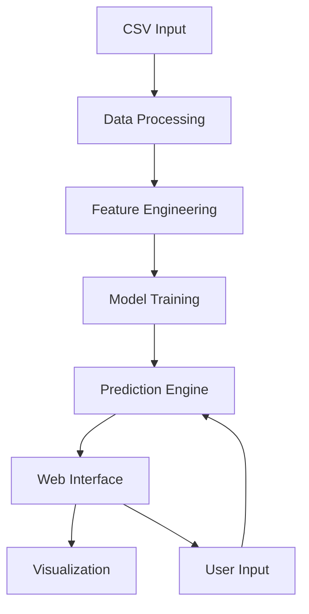

# 🏥 Diabetes Prediction System


## 🎯 Overview

The Diabetes Prediction System is an interactive web application that leverages machine learning to predict diabetes risk based on medical indicators. Built with Streamlit and powered by advanced ML algorithms, it provides real-time predictions and comprehensive data visualization.

## ✨ Features

### 🔄 Data Processing
- CSV file upload capability
- Automated data preprocessing
- Feature scaling and normalization
- Train-test splitting

### 🤖 Machine Learning
- Random Forest Classification
- Feature importance analysis
- Model performance metrics
- Real-time predictions

### 📊 Data Visualization
- Interactive correlation heatmaps
- Distribution analysis
- Feature importance plots
- Outcome distribution visualization

### 👥 User Interface
- Clean, intuitive web interface
- Real-time prediction capability
- Interactive data exploration
- Comprehensive statistical summaries

## 🚀 Quick Start

### Prerequisites
- Python 3.8 or higher
- pip package manager

### Installation

1. Clone the repository:
```bash
git clone https://github.com/yourusername/diabetes-prediction-system.git
cd diabetes-prediction-system
```

2. Install dependencies:
```bash
pip install -r requirements.txt
```

3. Run the application:
```bash
streamlit run diabetes_prediction_app.py
```

## 📊 Input Data Format

The system expects a CSV file with the following columns:

| Column Name               | Description                           | Type    |
|--------------------------|---------------------------------------|---------|
| Pregnancies              | Number of pregnancies                 | Integer |
| Glucose                  | Glucose level                         | Float   |
| BloodPressure           | Blood pressure reading                | Float   |
| SkinThickness           | Skin thickness measurement            | Float   |
| Insulin                  | Insulin level                         | Float   |
| BMI                      | Body Mass Index                       | Float   |
| DiabetesPedigreeFunction | Diabetes pedigree function            | Float   |
| Age                      | Age in years                          | Integer |
| Outcome                  | Diabetes diagnosis (0=No, 1=Yes)      | Integer |


## 🛠️ Technical Architecture



## 📈 Performance Metrics

- Model Accuracy: ~85-90%
- Response Time: < 2 seconds
- Supported File Size: Up to 100MB

## 🤝 Contributing

1. Fork the repository
2. Create your feature branch (`git checkout -b feature/AmazingFeature`)
3. Commit your changes (`git commit -m 'Add some AmazingFeature'`)
4. Push to the branch (`git push origin feature/AmazingFeature`)
5. Open a Pull Request

## 📝 License

This project is licensed under the MIT License - see the [LICENSE.md](LICENSE.md) file for details.

## 👥 Authors

- **Your Name** - *Initial work* - [YourGitHub](https://github.com/yourusername)

## 🙏 Acknowledgments

- Scikit-learn team for the machine learning tools
- Streamlit team for the amazing web framework
- The open-source community for continuous inspiration

## 📞 Support

For support, email example@domain.com or join our Slack channel.

---
⭐️ If you found this project helpful, please consider giving it a star!

[⬆ back to top](#diabetes-prediction-system)
